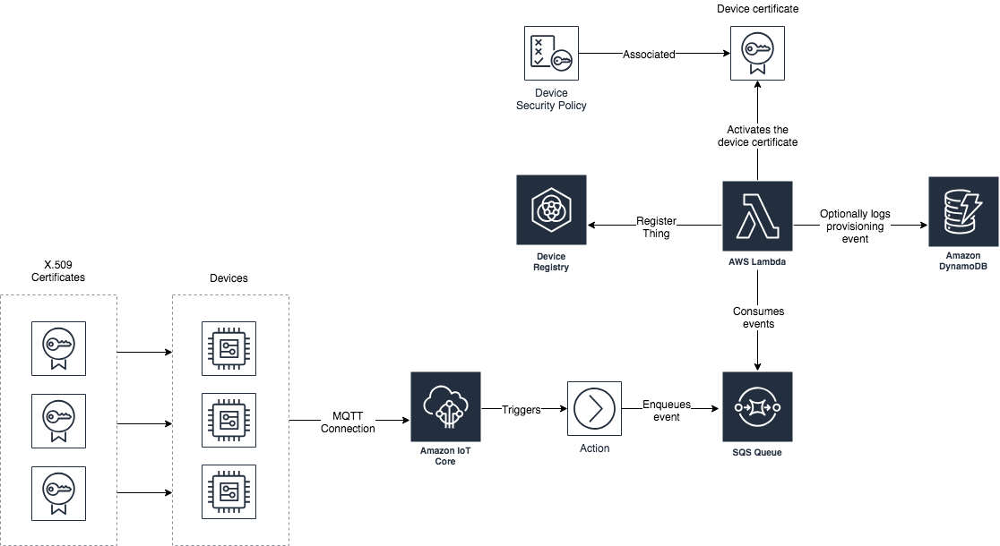
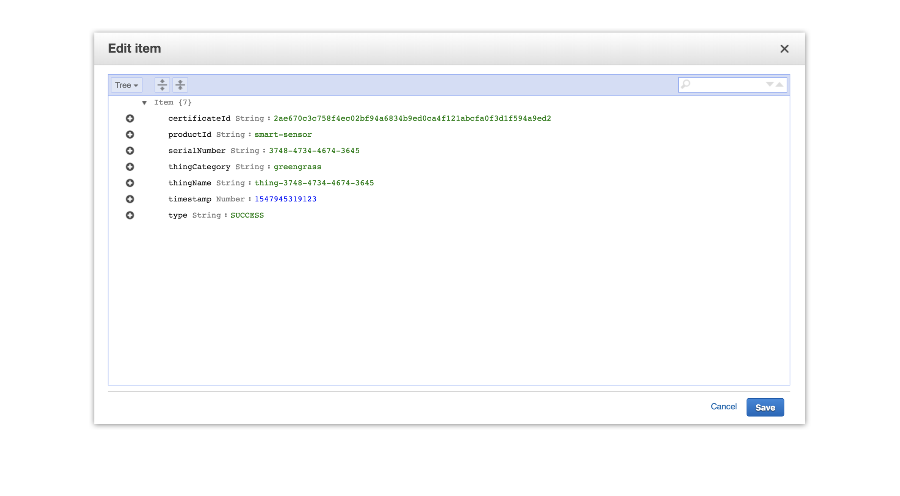
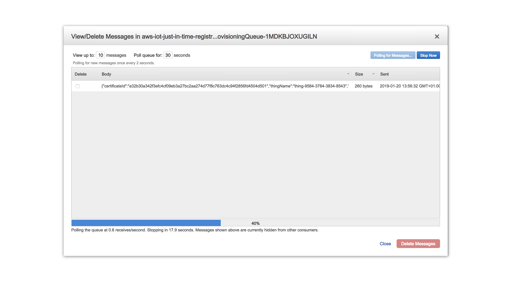
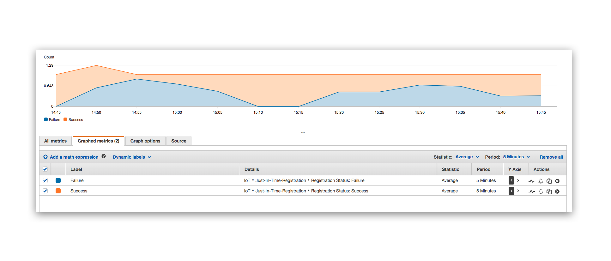

<br /><br />
<p align="center">
  
</p>
<br /><br />

# just-in-time-registration
> A universal implementation of the AWS JITR for IoT devices and AWS Greengrass.

[](contributing.md)
[](https://s3-us-west-2.amazonaws.com/codefactory-us-west-2-prod-default-build-badges/passing.svg)

Current version: **1.1.2**

Lead Maintainer: [Halim Qarroum](mailto:qarroumh@amazon.lu)

## 📋 Table of content

 - [Installation](#-install)
 - [Pre-requisites](#-pre-requisites)
 - [Metrics](#-metrics)
 - [Description](#-description)
 - [Certificate fields](#-certificate-fields)
 - [AWS Services Integration](#-aws-services-integration)
 - [See also](#-see-also)

## 🚀 Install

In order to add this block using `npm`, head to your project directory in your terminal and add it using NPM.

```bash
npm install @aws-blocks/just-in-time-registration
```

The stack will be available into the `node_modules/@aws-blocks` directory.

## 🎒 Pre-requisites

 - Usage of a Custom Root CAs for your AWS IoT certificates in order to allow Just-In-Time-Registration.
 - If using AWS Greengrass, then at least Greengrass 1.8.0 is required to work with this implementation.
 - You must have control over the generation of the certificates to be able to customize their fields.

## 📊 Metrics

The below metrics displays approximate values associated with deploying and using this block.

Metric | Value
------ | ------
**Type** | Architecture
**Deployment Time** | 3 minutes
**Audience** | Solutions Architects, Developers
**Workshop** | A [workshop](https://aws-blocks.io/workshops/universal-just-in-time-registration/workshop.html) is associated with this block.

## 🔰 Description

The Universal Just In Time Registration is a reference implementation of the [Just In Time Registration (JITR)](https://aws.amazon.com/fr/blogs/iot/just-in-time-registration-of-device-certificates-on-aws-iot/) for the AWS platform that supports auto-registration of IoT and AWS Greengrass devices connecting themselves directly to AWS IoT Core using X.509 certficates signed by a custom [Root Certificate of Authority (Root CA)](https://en.wikipedia.org/wiki/Root_certificate).

The JITR process requires usage and registration of a custom Root CA maintained by the owner or manufacturer of a device which allows them to issue certificates without involving the AWS IoT service (an example would be mass provisionning of devices within a factory before shipping). The AWS IoT service is then able to invoke a lambda function each time a non-registered certificate associated with the registered CA connects to the AWS IoT platform.

This implementation is *certificate-centric* in that it allows device owners the freedom to define specific attributes in their certificates in order to customize the provisionning process on AWS IoT. Since certificates are signed with your Root CA, and it is registered on AWS IoT, embedded fields are considered authentic and non-repudiable.
The universal JITR lambda function takes the following actions when a new device connects to the platform :

  1. It validates the certificate fields (see the [Certificate fields](#certificate-fields) section for more information on required fields). If the fields are incorrect, the registration process is aborted.
  2. It optionally calls an external implementer-provided Lambda function which can be served as a callback to define whether to continue the registration process or not. This can come in handy when implementers maintain a [Certificate Revocation List (CRL)](https://en.wikipedia.org/wiki/Certificate_revocation_list) for instance, but can be used for any purpose really.
  3. It creates a thing associated with the new device which will be provisioned with its certificates attributes in the AWS IoT device registry.
  4. It associates the created thing with a defined thing type.
  5. It creates a new IoT policy associated with the thing.
  6. It associates the created policy with the new thing.
  7. It creates a new AWS Greengrass group associated with the created thing if the certificate of the device identifies it as a Greengrass device.
  8. It activates the certificate in the AWS IoT certificate registry such that the device is granted access to the platform.

 > Note that the activation of the certificate is the latest step to be executed in order to guarantee that when a device suceeds to connect, every resources is already available on the account.

<br /><br />
<p align="center">
  
</p>
<br /><br />

## 🔐 Certificate fields

When the Just-In-Time-Registration process starts, a lookup will be made by the registration lambda on the fields that you use in your X.509 certificate and they will be automatically mapped to your thing attributes such that you can search and categorize your things using these attributes using [AWS IoT Fleet Indexing](https://docs.aws.amazon.com/iot/latest/developerguide/iot-indexing.html).

<br /><br />
<p align="center">
  
</p>
<br /><br />

You can embed any standard field into your X.509 certificates, but to enforce consistency and create appropriate semantics across a fleet, this implementation requires you to provide the following fields in the device certificate :

  - **serialNumber** - Allows to uniquely address your device on the platform.
  - **title** - Identifies the type of the device, supported values are `greengrass` to identify Greengrass devices or `iot` to identify a regular IoT device. This field will be used to determine whether the invoked Lambda function should create a Greengrass Group in addition to the thing in the AWS IoT device registry.
  - **generationQualifier** - The product identifier associated with the created thing. This will associate the created thing with a `product_id` attribute having this field as value. This field is also used by default in order to attach all the created things to a thing type named after this field.
  - **commonName** - The common name (CN) must be equal to the thing name of the device.

For IoT devices, note that the `clientId` of the connecting device must be equal to the thing name of the device in order to be able to leverage [Thing Policy Variables](https://docs.aws.amazon.com/iot/latest/developerguide/thing-policy-variables.html) in IoT policies.

> These required attributes will be associated to the created `Thing` in the AWS IoT device registry as searchable attributes. All the other certificate attributes contained in the certificate will be associated with non-searchable attributes on the created `Thing` object. Note that you can embed up to **50** attributes in your certificate, comprising the mandatory fields.

### Template parameterization

For the sake of genericity, the Cloudformation template associated with this project provides you with the ability to inject parameters before deploying the stack in the *Parameters* step of the CloudFormation deployment wizard.

The **PolicyName**, **ThingName**, **GreengrassGroupName** and the **ThingTypeName** parameters of the stack can be *parameterized* using specific variables at deployment-time. To use parameterized variables, you must keep the variables between the following enclosure : `<%= my-variable %>`.

As such, if the certificate's subject fields contains the serial number of the device and you want it to be part of its thing name naming policy, you can set the `ThingName` parameter of the template to the following value :

```js
thing-<%= certificate.attributes.subject.serialNumber %>
```

Note that many standard X.509 fields are associated with acronyms rather than full names, for instance the *common name* of a subject field in the certificate will be addressable with the `CN` identifier :

```js
thing-<%= certificate.attributes.subject.CN %>
```

Similarly, the `generationQualifier` standard field associated with a device can be addressed using the `2.5.4.44` identifier as follow :

```js
thing-<%= certificate.attributes.subject['2.5.4.44'] %>
```

As of this version, the variables accessible through the template is the `certificate` object which has the following schema.

<details><summary>See the object schema</summary>
<p>

```json
{
  "certificate": {
    "certificateDescription": {
      "certificateId": "The identifier of the certificate.",
      "certificateArn": "The Arn of the certificate.",
      "caCertificateId": "The certificate ID of the CA certificate used to sign this certificate.",
      "status": "The status of the certificate.",
      "certificatePem": "The certificate data, in PEM format.",
      "ownedBy": "The ID of the AWS account that owns the certificate.",
      "previousOwnedBy": "The ID of the AWS account of the previous owner of the certificate.",
      "creationDate": "The date and time the certificate was created.",
      "lastModifiedDate": "The date and time the certificate was last modified.",
      "transferData": "An associative object holding information relative to transfert data."
    },
    "awsAccountId": "The ID of the AWS account at the origin of the JITR message.",
    "attributes": {
      "subject": "Attributes associated with the certificate's subject field.",
      "issuer": "Attributes associated with the certificate's issuer field."
    }
  }
}
```

</p>
</details>

## ⚡️ AWS services integration

In addition to automatically provisioning your device registry, this implementation allows you to optionally integrate with third-party AWS services such as DynamoDB and SQS in order to log each provisioning action, or to allow to you to further integrate it within your existing infrastructure. We will log success events and their associated properties, as well as failure events with the produced error to allow you to pinpoint issues while provisioning devices.

### DynamoDB

While deploying the template, you can enable the **LogEventsToDynamo** parameter which will create a new DynamoDB on-demand table (in order to best respond to spike provisioning events without requiring that you provision reads and writes ahead of time) and have all the events being logged into this table.

<br /><br />
<p align="center">
  
</p>

If you want to further integrate these events with your data lake, you can create a DynamoDB stream associated with this table which will redirect them to an S3 bucket.

### SQS

We also offer the ability to push the created provisioning events to an SQS queue which you can enable by toggling the **LogEventsToSqs** parameter of the Cloudformation template.

<br /><br />
<p align="center">
  
</p>

This can allow you to handle the messages as discrete transactions and integrate them with your internal messaging system to perform additional actions (e.g integrate the SQS queue with SNS and have a message sent to an HTTPS endpoint, etc.).

### AWS CloudWatch

When devices are getting connected to AWS IoT Core platform, the registration process can succeed or fail. This implementation allows you to optionally send 3 different metric types to AWS CloudWatch under the standard namespace `AWS/IoT`.

Metric Name                   | Dimension Key       | Dimension Value | Metric Value                | Description
----------------------------- | ------------------- | --------------- | --------------------------- | -----------
**Just-In-Time-Registration** | Registration Status |    `Success`    |   1 on success, 0 otherwise | Metric that counts the number of registrations that have succeeded.
**Just-In-Time-Registration** | Registration Status |    `Failure`    |   1 on failure, 0 otherwise | Metric that counts the number of registrations that have failed.
**Just-In-Time-Registration** | Registration Status |    `Overall`    |   1 regardless of success   | Metric that counts the overall number of registrations that have occured.

> You can enable AWS CloudWatch integration by toggling the **LogEventsToCloudWatch** parameter of the Cloudformation template.

<br />
<p align="center">
  
</p>

This integration allows you to have an overview of the behavior of the Just-In-Time-Registration process from an operational point of view, and register CloudWatch alarms associated with the aforementioned metrics in order to receive proactive notifications alerting you that something is going wrong.

## 👀 See Also

 - [jitr-workshop](https://aws-blocks.io/package.html?name=@aws-blocks/jitr-workshop) - A workshop demonstrating the use of the Universal Just-In-Time-Registration implementation.
 - [ansible-greengrass](https://aws-blocks.io/package.html?name=@aws-blocks/ansible-greengrass) - An automated device provisioning for AWS Greengrass with Ansible.
 - The [Just In Time Registration (JITR)](https://aws.amazon.com/fr/blogs/iot/just-in-time-registration-of-device-certificates-on-aws-iot/) blog post.
